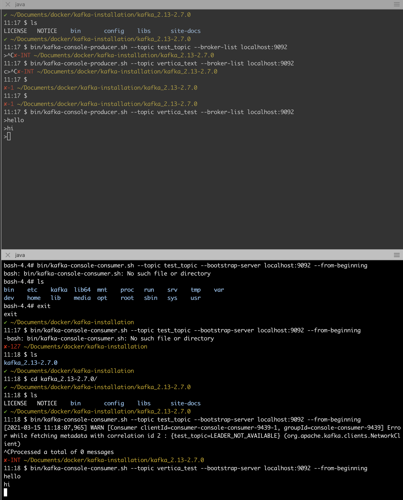

# Docker로 카프카 로컬환경 만들기   

Docker로 로컬환경에 Kafka 설치하기

```
$ git clone https://github.com/wurstmeister/kafka-docker
```

Docker-compose-single-broker.yml 수정

```
version: '2’ 
services: 
    zookeeper: 
        image: wurstmeister/zookeeper 
        ports: - "2181:2181” 
    kafka: 
        build: . 
        ports: 
            - "9092:9092” 
        environment: 
            KAFKA_ADVERTISED_HOST_NAME: 127.0.0.1 
            KAFKA_CREATE_TOPICS: "test:1:1” 
            KAFKA_ZOOKEEPER_CONNECT: zookeeper:2181 
        volumes: - /var/run/docker.sock:/var/run/docker.sock
```

Docker-compose 시작

준비가 다 됐으면 명령어로 zookeeper 1대, 카프카 클러스터를 1대를 시작한다. Docker-compose.yml에 정의된 대로 docker-compose를 통해 서버를 실행한다.

```
$ docker-compose -f docker-compose-single-broker.yml up
```

카프카가 제대로 설치되었는지 테스트하기 위해서는 공식 홈페이지에서 docker-compose로 구동한 카프카와 동일한 버전의 바이너리를 다운로드한다. 우리가 클론해서 사용하는 kafaka-docker의 Dockerfile에 명시된 버전을 다운로드 받는다. 
```
$ wget https://apache.mirror.cdnetworks.com/kafka/2.5.0/kafka_2.12-2.5.0.tgz 
$ tar xzvf kafka_2.12-2.5.0.tgz 
$ cd /opt/kafka-docker/kafka_2.12-2.5.0/
```

카프카 토픽 생성하기

```
$ bin/kafka-topics.sh --create --zookeeper localhost:2181 --replication-factor 1 --partitions 1 --topic vertica_test
```

Producer 실행

```
$ bin/kafka-console-producer.sh --broker-list localhost:9092 --topic vertica_test
```


Consumer 실행

```
$ bin/kafka-console-consumer.sh --bootstrap-server localhost:9092 --topic vertica_test --from-beginning
```

결과
---
